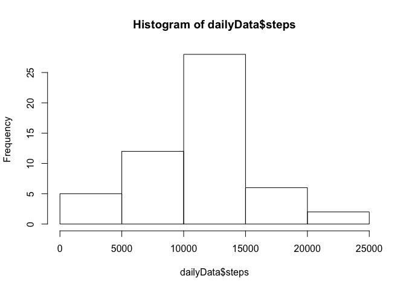
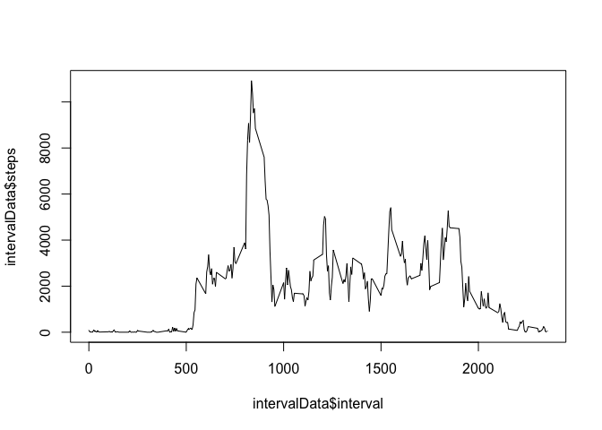
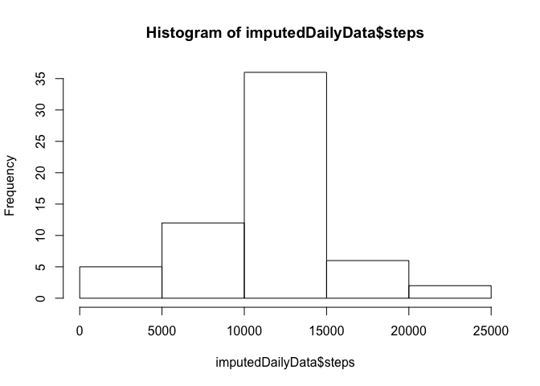
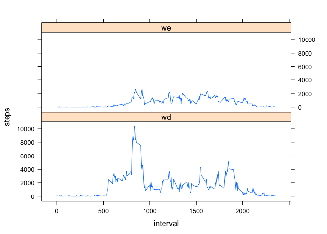

# Reproducible Research: Peer Assessment 1


## Loading and preprocessing the data


```r
data <- read.csv(unz("./activity.zip", "activity.csv"))
summary(data)
```

```
##      steps                date          interval     
##  Min.   :  0.00   2012-10-01:  288   Min.   :   0.0  
##  1st Qu.:  0.00   2012-10-02:  288   1st Qu.: 588.8  
##  Median :  0.00   2012-10-03:  288   Median :1177.5  
##  Mean   : 37.38   2012-10-04:  288   Mean   :1177.5  
##  3rd Qu.: 12.00   2012-10-05:  288   3rd Qu.:1766.2  
##  Max.   :806.00   2012-10-06:  288   Max.   :2355.0  
##  NA's   :2304     (Other)   :15840
```


```r
# Massage data into steps taken per day
dailyData <- aggregate(steps ~ date, data, sum, na.rm=T)
summary(dailyData)
```

```
##          date        steps      
##  2012-10-02: 1   Min.   :   41  
##  2012-10-03: 1   1st Qu.: 8841  
##  2012-10-04: 1   Median :10765  
##  2012-10-05: 1   Mean   :10766  
##  2012-10-06: 1   3rd Qu.:13294  
##  2012-10-07: 1   Max.   :21194  
##  (Other)   :47
```


```r
# Massage data into steps taken per 5-minute interval
intervalData <- aggregate(steps ~ interval, data, sum, na.rm=T)
intervalMeans <- aggregate(steps ~ interval, data, mean, na.rm=T)
summary(intervalData)
```

```
##     interval          steps        
##  Min.   :   0.0   Min.   :    0.0  
##  1st Qu.: 588.8   1st Qu.:  131.8  
##  Median :1177.5   Median : 1808.0  
##  Mean   :1177.5   Mean   : 1981.3  
##  3rd Qu.:1766.2   3rd Qu.: 2800.2  
##  Max.   :2355.0   Max.   :10927.0
```

```r
summary(intervalMeans)
```

```
##     interval          steps        
##  Min.   :   0.0   Min.   :  0.000  
##  1st Qu.: 588.8   1st Qu.:  2.486  
##  Median :1177.5   Median : 34.113  
##  Mean   :1177.5   Mean   : 37.383  
##  3rd Qu.:1766.2   3rd Qu.: 52.835  
##  Max.   :2355.0   Max.   :206.170
```

## What is mean total number of steps taken per day?


```r
print(sprintf("Steps taken total: %d", sum(data$steps, na.rm=T)))
```

```
## [1] "Steps taken total: 570608"
```

```r
print(sprintf("Mean steps taken per 5-minute period: %f", mean(data$steps, na.rm=T)))
```

```
## [1] "Mean steps taken per 5-minute period: 37.382600"
```

```r
print(sprintf("Median steps taken per 5-minute period: %f", median(data$steps, na.rm=T)))
```

```
## [1] "Median steps taken per 5-minute period: 0.000000"
```

```r
print(sprintf("Mean steps taken per day: %f", mean(dailyData$steps, na.rm=T)))
```

```
## [1] "Mean steps taken per day: 10766.188679"
```

```r
print(sprintf("Median steps taken per day: %f", median(dailyData$steps, na.rm=T)))
```

```
## [1] "Median steps taken per day: 10765.000000"
```

```r
hist(dailyData$steps)
```

<!-- -->

## What is the average daily activity pattern?


```r
# Plot time-series of total steps across 5-minute intervals, across all days
plot(intervalData$steps ~ intervalData$interval, type="l")
```

<!-- -->


```r
# Which interval # is the highest overall?
head(sapply(intervalData, sort, decreasing=T), n=1)
```

```
##      interval steps
## [1,]     2355 10927
```

## Imputing missing values


```r
# How many 5-minute intervals have missing data?
sum(is.na(data$steps))
```

```
## [1] 2304
```

```r
# How many valid records?
sum(!is.na(data$steps))
```

```
## [1] 15264
```

```r
# Fill in missing data with median from that interval
data2 <- data
data2[is.na(data2$steps),]$steps <- intervalMeans$steps

# Summary of imputed data
summary(data2)
```

```
##      steps                date          interval     
##  Min.   :  0.00   2012-10-01:  288   Min.   :   0.0  
##  1st Qu.:  0.00   2012-10-02:  288   1st Qu.: 588.8  
##  Median :  0.00   2012-10-03:  288   Median :1177.5  
##  Mean   : 37.38   2012-10-04:  288   Mean   :1177.5  
##  3rd Qu.: 27.00   2012-10-05:  288   3rd Qu.:1766.2  
##  Max.   :806.00   2012-10-06:  288   Max.   :2355.0  
##                   (Other)   :15840
```

```r
# Calculate mean, median, daily histogram with imputed data
imputedDailyData <- aggregate(steps ~ date, data2, sum, na.rm=T)
summary(imputedDailyData)
```

```
##          date        steps      
##  2012-10-01: 1   Min.   :   41  
##  2012-10-02: 1   1st Qu.: 9819  
##  2012-10-03: 1   Median :10766  
##  2012-10-04: 1   Mean   :10766  
##  2012-10-05: 1   3rd Qu.:12811  
##  2012-10-06: 1   Max.   :21194  
##  (Other)   :55
```

```r
print(sprintf("Mean steps taken per day: %f", mean(imputedDailyData$steps, na.rm=T)))
```

```
## [1] "Mean steps taken per day: 10766.188679"
```

```r
print(sprintf("Median steps taken per day: %f", median(imputedDailyData$steps, na.rm=T)))
```

```
## [1] "Median steps taken per day: 10766.188679"
```

```r
hist(imputedDailyData$steps)
```

<!-- -->

The mean remains unchanged but the median has increased slightly by 1 step per day.


## Are there differences in activity patterns between weekdays and weekends?


```r
data2$dayOfWeek <- factor(weekdays(as.Date(data2$date)))
levels(data2$dayOfWeek) <- c("wd", "wd", "we", "we", "wd", "wd", "wd")
summary(data2)
```

```
##      steps                date          interval      dayOfWeek 
##  Min.   :  0.00   2012-10-01:  288   Min.   :   0.0   wd:12960  
##  1st Qu.:  0.00   2012-10-02:  288   1st Qu.: 588.8   we: 4608  
##  Median :  0.00   2012-10-03:  288   Median :1177.5             
##  Mean   : 37.38   2012-10-04:  288   Mean   :1177.5             
##  3rd Qu.: 27.00   2012-10-05:  288   3rd Qu.:1766.2             
##  Max.   :806.00   2012-10-06:  288   Max.   :2355.0             
##                   (Other)   :15840
```

```r
# Aggregate steps over weekends, weekdays
weekdayVsWeekendSteps <- aggregate(steps ~ dayOfWeek + interval, data2, sum, na.rm=T)
head(weekdayVsWeekendSteps)
```

```
##   dayOfWeek interval       steps
## 1        wd        0 101.3018868
## 2        we        0   3.4339623
## 3        wd        5  20.0377358
## 4        we        5   0.6792453
## 5        wd       10   7.7924528
## 6        we       10   0.2641509
```


```r
library(lattice)
# Plot timeseries of weekend, weekday steps, across interval identifier
xyplot(steps ~ interval | dayOfWeek, data=weekdayVsWeekendSteps, type="l", layout=c(1,2))
```

<!-- -->

On weekends, steps throughout the afternoon are relatively constant, while there isn't much evening or morning activity. Weekdays show the most activity at mid-day.
